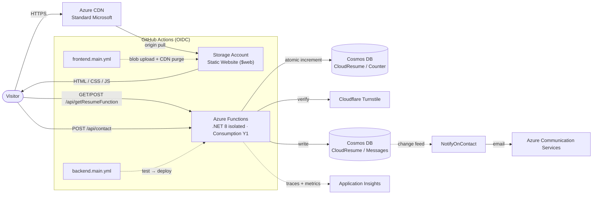

# Azure Resume

A serverless résumé site on Azure with a live visitor counter and contact form — my take on the
[Cloud Resume Challenge](https://cloudresumechallenge.dev/) by Forrest Brazeal.

**Live:** <https://llewellynbooth.com>

[](https://github.com/llewellynbooth/my-Azure-Resume/actions/workflows/frontend.main.yml)
[](https://github.com/llewellynbooth/my-Azure-Resume/actions/workflows/backend.main.yml)
[](https://github.com/llewellynbooth/my-Azure-Resume/actions/workflows/codeql.yml)

---

## What it is

A static résumé page hosted on Azure Storage and served through Azure CDN on a custom domain. A
.NET 8 Azure Functions API (isolated worker) backs the dynamic features — a visitor counter, a
contact form with email notification, and a health check — persisting to Cosmos DB. GitHub
Actions deploys both halves with OIDC. Running cost is about **A$0.60/month** on free tiers.

## Architecture



**Request flow:** the browser loads static content from the CDN (origin = the Storage static
website) on `llewellynbooth.com`. Client-side JS calls `/api/getResumeFunction`, which reads the
`index` document from the `Counter` container, increments it atomically with a patch operation,
and returns the new count. The contact form POSTs to `/api/contact`, which checks a honeypot,
verifies the Cloudflare Turnstile token, validates and HTML-encodes the payload, applies a
per-IP rate limit, and appends a document to the `Messages` container. A separate
change-feed-triggered function (`NotifyOnContact`) picks that document up and emails it via Azure
Communication Services. Application Insights collects function traces and Cosmos dependency calls.

## Tech stack

| Layer | Choice |
|---|---|
| Frontend | Hand-authored static HTML + one stylesheet + vanilla JS — no framework, no build step; light/dark toggle, inline-SVG icons, static certification grid, contact form wired to the API |
| Hosting | Azure Storage static website, fronted by Azure CDN (Standard Microsoft); custom domain `llewellynbooth.com` (apex via CDN + BYO cert, `www` → apex redirect at Cloudflare) |
| API | C# / .NET 8, Azure Functions v4 — isolated worker (SDK v2), ASP.NET Core integration |
| Database | Azure Cosmos DB for NoSQL — free tier, 400 RU/s, `Counter` + `Messages` (+ `leases`) containers |
| Notifications | Azure Communication Services (email) via a Cosmos change-feed trigger |
| Anti-spam | Cloudflare Turnstile (server-side verify) + honeypot + per-IP rate limit |
| Monitoring | Application Insights |
| IaC | Terraform config present (`azurerm ~> 4.14`) but **not yet reconciled** with the live estate — portal-managed for now, see [`infrastructure/README.md`](infrastructure/README.md) |
| CI/CD | GitHub Actions — frontend deploy + backend test/deploy, OIDC auth |
| Tests | xUnit (`backend/tests`) |
| Region | Australia East |

### API endpoints

| Method | Route | Purpose |
|---|---|---|
| `GET` / `POST` | `/api/getResumeFunction` | Read (GET) and atomically increment (POST) the visitor counter |
| `POST` | `/api/contact` | Validate, Turnstile-verify, and store a contact-form message |
| `GET` | `/api/health` | Liveness check + Cosmos connectivity |

`NotifyOnContact` has no HTTP route — it's a Cosmos change-feed trigger on the `Messages`
container that emails new submissions.

## Repository layout

```
frontend/         Static site (HTML/CSS/JS, images, SEO files)
backend/
  api/            Azure Functions project (.NET 8) — getResumeFunction, ContactForm,
                  HealthCheck, NotifyOnContact
  tests/          xUnit unit tests
infrastructure/   Terraform (main.tf) — not yet reconciled with the live estate
.github/workflows/
  frontend.main.yml   Upload frontend/ to $web, purge CDN
  backend.main.yml    Test on PR; test + build + deploy on push to main
```

## Running locally

**Frontend** — serve the folder with any static server:

```bash
cd frontend
python -m http.server 8080
```

**Backend** — needs the Azure Functions Core Tools and a `backend/api/local.settings.json`
(git-ignored). Copy `local.settings.json.example` and fill in the `CloudResume` Cosmos
connection string; the `ACS_*` / `NOTIFY_*` / `TURNSTILE_SECRET` values are optional — those
code paths no-op when unset, so the counter and contact store work without them:

```bash
cd backend/api
func start          # http://localhost:7071/api/getResumeFunction
```

**Tests**

```bash
dotnet test backend/tests
```

## Infrastructure

The running estate (Storage static site, Azure CDN, two Function Apps, Cosmos
`azureresume100`, Application Insights, Communication Services) currently lives in the
`Azureresume-rg` resource group and is **managed manually in the portal**. DNS is at Cloudflare
(the Azure DNS zone was retired). `infrastructure/main.tf` is a Terraform description
of the intended shape but has **not been imported or applied** — resource names differ and
there is no state backend yet. Reconciling it is a tracked task; see
[`infrastructure/README.md`](infrastructure/README.md) and
[`docs/adr/0005`](docs/adr/0005-terraform-not-reconciled.md).

## Reliability

Target: **99.9% availability**, API **p95 < 300 ms**. A synthetic probe
(`.github/workflows/synthetic.yml`) checks the site, `/api/health` and the counter
every 15 minutes and opens an issue on failure. Health: `GET /api/health`.

## Quality & security gates

- **CodeQL** on every push and PR (C# + JS), plus weekly.
- **Lighthouse CI** on frontend PRs — accessibility and SEO must stay ≥ 95.
- **Synthetic probe** every 15 min — site, `/api/health`, counter; opens an issue on failure.
- **Dependabot** (NuGet + Actions) weekly.
- CI authenticates to Azure with **OIDC** — no stored credentials.
- [`SECURITY.md`](SECURITY.md) · [`docs/threat-model.md`](docs/threat-model.md)

## Cost

| Resource | Monthly (approx.) |
|---|---|
| Storage account | A$0.50 |
| Functions (Consumption) | A$0 — free grant |
| Cosmos DB | A$0 — account free tier |
| CDN | A$0.10 |
| Application Insights | A$0 — 5 GB free |
| **Total** | **~A$0.60** |

## Roadmap

**Done** — **frontend rebuilt** from scratch (no framework/build step, ~450 KB of template
JS/CSS deleted, light+dark, static certification grid, contact form wired to the API); Functions
on the .NET 8 **isolated worker** model, dependencies refreshed to current (Worker SDK v2);
frontend + backend CI/CD on OIDC workload identity (no stored secrets); `dotnet test` gate
before deploy; **atomic** counter (`PatchItemAsync` increment) with GET read / POST write;
contact form hardened (validation, honeypot, HTML-encoding, per-IP rate limit, Cloudflare
Turnstile) and unit-tested; **email notification** on new messages via a Cosmos change-feed
trigger + Azure Communication Services; Cosmos access behind a small store layer;
**custom domain** `llewellynbooth.com` with `www` → apex redirect; **ADRs, runbook, threat
model, `SECURITY.md`** and CodeQL / Lighthouse / synthetic-probe CI gates; Bicep retired.

**Next**, roughly in priority order:

- **Reconcile Terraform with the live estate** — rename resources in `main.tf` to match, stand
  up a state backend, `terraform import`, plan-to-zero, then re-add a CI workflow.
- **Distributed rate limiting** for `/api/contact` — the current limiter is per-instance.
- **Managed TLS** — move the apex to a Cloudflare-proxied or CDN-managed certificate to retire
  the BYO cert renewal cycle.

Detailed change history is in [`IMPROVEMENTS.md`](IMPROVEMENTS.md).

## Engineering docs

- [`docs/adr/`](docs/adr/) — Architecture Decision Records: why isolated worker, why
  `CosmosClient` over bindings, why OIDC, why Front Door is deferred, why Terraform
  isn't reconciled yet, and more.
- [`docs/runbook.md`](docs/runbook.md) — what's where, how deploys work, common
  failure modes and fixes, rollback, key rotation.

## Credits

- [Cloud Resume Challenge](https://cloudresumechallenge.dev/) — Forrest Brazeal
- Frontend started from a free open-source résumé template, since customised
