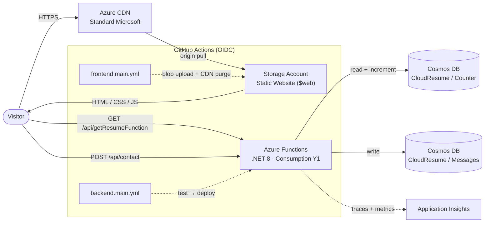

# Azure Resume

A serverless résumé site on Azure with a live visitor counter and contact form — my take on the
[Cloud Resume Challenge](https://cloudresumechallenge.dev/) by Forrest Brazeal.

**Live:** <https://resumestore100.z8.web.core.windows.net/> (CDN-fronted at
<https://azureresumellewellyn.azureedge.net>)

[](https://github.com/llewellynbooth/my-Azure-Resume/actions/workflows/frontend.main.yml)
[](https://github.com/llewellynbooth/my-Azure-Resume/actions/workflows/backend.main.yml)
[](https://github.com/llewellynbooth/my-Azure-Resume/actions/workflows/terraform.yml)

---

## What it is

A static résumé page hosted on Azure Storage and served through Azure CDN. A .NET 8 Azure
Functions API backs two dynamic features — a visitor counter and a contact form — persisting to
Cosmos DB. Everything is defined in Terraform and deployed by GitHub Actions. Running cost is
about **A$0.60/month** on free tiers.

## Architecture



**Request flow:** the browser loads static content from the CDN (origin = the Storage static
website). Client-side JS calls `/api/getResumeFunction`, which reads the `index` document from
the `Counter` container, increments it, writes it back via the Cosmos output binding, and returns
the new count. The contact form POSTs to `/api/contact`, which validates the payload and appends
a document to the `Messages` container. Application Insights collects function traces and Cosmos
dependency calls.

## Tech stack

| Layer | Choice |
|---|---|
| Frontend | Static HTML / CSS / JS — dark-mode toggle, Credly badge embed, Font Awesome |
| Hosting | Azure Storage static website, fronted by Azure CDN (Standard Microsoft) |
| API | C# / .NET 8, Azure Functions v4 (isolated worker model, ASP.NET Core integration) |
| Database | Azure Cosmos DB for NoSQL — free tier, 400 RU/s, `Counter` + `Messages` containers |
| Monitoring | Application Insights |
| IaC | Terraform config present (`azurerm ~> 4.14`) but **not yet reconciled** with the live estate — portal-managed for now, see [`infrastructure/README.md`](infrastructure/README.md) |
| CI/CD | GitHub Actions — frontend deploy + backend test/deploy, OIDC auth |
| Tests | xUnit (`backend/tests`) |
| Region | Australia East |

### API endpoints

| Method | Route | Purpose |
|---|---|---|
| `GET` / `POST` | `/api/getResumeFunction` | Read and increment the visitor counter |
| `POST` | `/api/contact` | Store a contact-form message |
| `GET` | `/api/health` | Liveness check + Cosmos connectivity |

## Repository layout

```
frontend/         Static site (HTML/CSS/JS, images, SEO files)
backend/
  api/            Azure Functions project (.NET 8) — Counter, ContactForm, HealthCheck
  tests/          xUnit unit tests
infrastructure/   Terraform (main.tf) — not yet reconciled with the live estate
.github/workflows/
  frontend.main.yml   Upload frontend/ to $web, purge CDN
  backend.main.yml    Test on PR; test + build + deploy on push to main
```

## Running locally

**Frontend** — serve the folder with any static server:

```bash
cd frontend
python -m http.server 8080
```

**Backend** — needs the Azure Functions Core Tools and a `backend/api/local.settings.json`
(git-ignored) providing the `CloudResume` Cosmos connection string:

```bash
cd backend/api
func start          # http://localhost:7071/api/getResumeFunction
```

**Tests**

```bash
dotnet test backend/tests
```

## Infrastructure

The running estate (Storage static site, CDN/Front Door, two Function Apps, Cosmos
`azureresume100`, Application Insights) currently lives in the `Azureresume-rg` resource group
and is **managed manually in the portal**. `infrastructure/main.tf` is a Terraform description
of the intended shape but has **not been imported or applied** — resource names differ and
there is no state backend yet. Reconciling it is a tracked task; see
[`infrastructure/README.md`](infrastructure/README.md).

## Cost

| Resource | Monthly (approx.) |
|---|---|
| Storage account | A$0.50 |
| Functions (Consumption) | A$0 — free grant |
| Cosmos DB | A$0 — account free tier |
| CDN | A$0.10 |
| Application Insights | A$0 — 5 GB free |
| **Total** | **~A$0.60** |

## Roadmap

**Done** — Functions migrated to the .NET 8 **isolated worker** model; frontend + backend CI/CD
on OIDC workload identity (no stored secrets); `dotnet test` gate before backend deploy;
contact form hardened (length limits, regex email check, honeypot, output encoding); legacy
vendored JS and committed build artifacts removed; Bicep retired.

**Next**, roughly in priority order:

- **Rotate credentials** — the repo is public; the historical hardcoded API key remains in git
  history, so rotate the Cosmos key and any old service principal.
- **Reconcile Terraform with the live estate** — rename resources in `main.tf` to match, stand
  up a state backend, `terraform import`, plan-to-zero, then re-add a CI workflow.
- **Frontend rebuild.** Retire the remaining `plugins.js` bundle and the jQuery-era template.
- **CDN → Front Door** (confirm whether the profile is already Front Door) + **custom domain +
  managed TLS**.

Detailed change history is in [`IMPROVEMENTS.md`](IMPROVEMENTS.md).

## Credits

- [Cloud Resume Challenge](https://cloudresumechallenge.dev/) — Forrest Brazeal
- Frontend started from a free open-source résumé template, since customised
